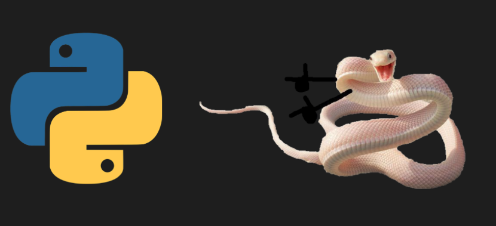
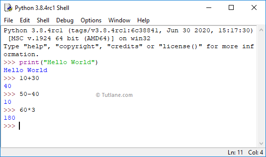
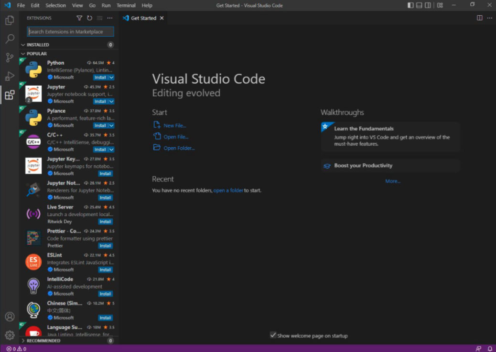

# Въведение в Python и настройка на средата

## Какво е Python?



Python е [high-level](https://www.geeksforgeeks.org/difference-between-high-level-and-low-level-languages/) език за програмиране, който е [интерпретируем](https://www.geeksforgeeks.org/difference-between-compiler-and-interpreter/), [динамично-типизиран](https://www.educative.io/answers/what-is-dynamic-typing#) и мултипарадигмен. Синтаксисът му е семпъл и лесен за научаване. Комибнацията от всичко изброено прави Python един мощен език за програмиране.

### За какво се ползва?

* **Скриптове** (автоматизация, DevOps, системна администрация, клауд услуги, конзолни инструменти, т.н.)
* **Machine Learning и Data Science** (посредством библиотеки като TensorFlow, PyTorch, Scikit-learn, Pandas, NumPy, SciPy, Matplotlib и т.н.)
* **Уеб сървъри** (бекенд, посредством библиотеки като Django, Flask, FastAPI, т.н.)
* **Desktop приложения** (по-рядко)

### Версии

* **0.9** (1991) - първа версия
* **1.0** (1994)
* **2.0** (2000)
* **3.0** (2008)
* **2.7** (2010) - последната minor версия на Python 2
* **3.9** (окт. 2020)
* **3.10** (окт. 2021)
* **3.11** (окт. 2022)
* 3.12 е [планирана](https://peps.python.org/pep-0693/) за окт. 2023г.
* 4.0 [може и да няма](https://builtin.com/software-engineering-perspectives/python-4)

### Какви са минусите на Python?

* **Бавен** - в пъти даже, в сравнение с езици като C/C++ и Java (макар и в 3.11 да са направени подобрения на скоростта)
* **Multi-threading-ът е неефективен** - това ще го разберем защо е така  [по-късно в курса](../09%20-%20Multithreading/).
* **Не е особено подходящ за enterprise системи** - заради типизация, скорост и други причини
* **(Почти) не може да се пишат мобилни приложения на него**

### Какви са плюсовете на Python?

* **Лесен синтаксис**
* **Мощен** - с малко код могат да се направят много неща
* **Мултипарадигмен** - поддържа функционален, обектно-ориентирен и процедурен стил на програмиране
* **Мултиплатформен** - работи на Windows, Linux, Mac и се **съдържа по подразбиране в Linux** дистрибуциите
* **Най-популярният** език (конкурира се с JavaScript) [от няколко години насам](https://youtu.be/qQXXI5QFUfw?si=rN7-FmBV5FWPi_zL&t=392) (главният заподозрян за това е AI и Data Science бума) - това означава, че ако ви трябва библиотека за нещо, то най-вероятно вече я има (както и наличието огромното community от хора, които да отговарят на въпроси и т.н)
* **C interoperability** - може да работи със С код и така да използва всичките предимства на по-low-level езикът за програмиране (най-вече бързодействие). И това ще го разберем как става към [края на курса](../16%20-%20Using%20C%20code%20in%20Python/)

## Инсталиране на Python

### Windows

0. ~~Минете на Linux~~
1. Изтеглете последната версия на Python от [официалния сайт](https://www.python.org/downloads/windows/)
2. Инсталирайте Python, като отбележите опцията **Add Python 3.x to PATH** (това е с цел да може да изпълняваме `python` от командния ред)
3. Оставете всичко друго по подразбиране и цъкнете Install Now.

Ако всичко е приключило успешно, би трябвало да имате вече програма Python IDLE (или Python Shell), която като отворите ще ви покаже интерактивна конзола, в която можете да изпробвате разични Python изрази:



Същото нещо би трябвало да можете да достъпите и през терминала (понеже сме отметнали опцията *Add Python 3.x to PATH*), като изпълните командата `python`:


(излиза се с `exit()`)

### Linux

Ако нямате вече `python`/`python3`, то или дистрибуцията ви е крайно прецакана, или имате някакво твърде obscure Linux distro. За да видите дали вече имате Python 3 инсталиран (и конкретната му версия), изпълнете командата:

```bash
python3 --version
```

⚠️ **Важно:** В курсът изучаваме само Python 3. Командата `python` (без тройката) също съществува, но тя подкарва Python 2, който е deprecated и не трябва да се използва повече.

И все пак, ако случайно нямате Python, то може да го инсталирате чрез специфичния за дистрибуцията ви package manager. Някои по-популярни примери:

### macOS

Също както при линукс, проверете дали имате вече `python3` командата, чрез:
    
```bash 
python3 --version
```

В случай, че видите точна версия - поздравления, вече сте сложили Python 3. Ако пък командата гръмне, то най-вероятно нямате Xcode Command-line Tools. Те идват вградени с [Xcode](https://apps.apple.com/bg/app/xcode/id497799835?mt=12), но могат и да бъдат инсталирани отделно самостоятелно чрез:
```bash
xcode-select --install
```
С тях получавате `python`, `git` и доста други developer-ски благинки.

## Инсталиране и настройка на редактор / IDE

Тук са описани стъпки за инсталиране на две програми за разработка на Python код - Visual Studio Code и PyCharm. 

Как да избера кое да ползвам?

| VSCode | PyCharm |
| ------ | ------- |
| ✅ Безплатна | ✅ Безплатна за студенти от ФМИ*  |
| ⚙️ По-конфигурируема | 🚀 По-лесна за настройка |
| 🐙 За всякакви езици | 🐍 Специализирана за Python |
| 🪶 По-лека** | 🐳  По-тежка |


(*) Community edition е безплатна версия за всички; Professional edition е платена, но при регистрация с университетския имейл получавате безплатен лиценз

(**) освен ако не ѝ се инсталират допълнително твърде много тежки плъгини

### Visual Studio Code

VSCode е удобен **текстов редактор**, специално създаден за редактиране на сорс код. Той е лек, бърз и лесно конфигурируем за всякакви езици и нужди, чрез мнжеството разширения (още extensions/plugins), които могат да му се инсталират.

1. Свалете VSCode от [официалния сайт](https://code.visualstudio.com/download)
2. Инсталирайте го
3. Отворете VSCode
4. Oтворете Extensions Marketplace панела, по един от следните три начина:
    * от лентата с инструменти вляво (иконката с формата на тетрис квадратчета)
    * от менюто `View > Extensions`
    * с Ctrl+Shift+X (или ⌘⇧X на macOS)
5. Потърсете и изтеглете следните 3 плъгина:
    * [Code Runner](https://marketplace.visualstudio.com/items?itemName=formulahendry.code-runner) (за пускане и дебъгване на код)
    * [Python](https://marketplace.visualstudio.com/items?itemName=ms-python.python) (за Python syntax highlighting и др.)
    * [Pylance](https://marketplace.visualstudio.com/items?itemName=ms-python.vscode-pylance) (за Python intellisense, autocompletion и др.)
    * (по желание) [Jupyter](https://marketplace.visualstudio.com/items?itemName=ms-toolsai.jupyter) (за работа с Jupyter notebooks, в какъвто формат са и лекциите в курса)



#### Първият ви Python файл

1. Отворете VSCode
2. Отворете нов файл (File > New File) (или с Ctrl+N / ⌘N)
3. Напишете `print("Hello, world!")`
4. Запазете файла (File > Save) (или с Ctrl+S / ⌘S)
5. Пуснете го с Run > Run without Debugging

### PyCharm

PyCharm е **интегрирана среда за разработка** (IDE), специално създадена за Python. Тя е много по-тежка от VSCode, но идва с много повече вградени функционалности, които са полезни за разработка на по-големи проекти.

Tя е продукт на JetBrains, която е известна със своите IDE-та за всякакви езици и проекти (напр. IntelliJ за Java, CLion за C/C++, WebStorm за JavaScript и т.н.), които са визуално и функционално подобни помежду си (което е плюс за хора, свикнали да ползват друго тяхно IDE).

Можете да свалите PyCharm от [официалния сайт на JetBrains](https://www.jetbrains.com/pycharm/download/). Има две версии - Community и Professional. Community е безплатна, но е по-ограничена във функционалностите си. Professional е платена, но студентите от ФМИ могат да си вземат безплатен лиценз, като се регистрират с университетски имейл.