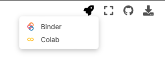
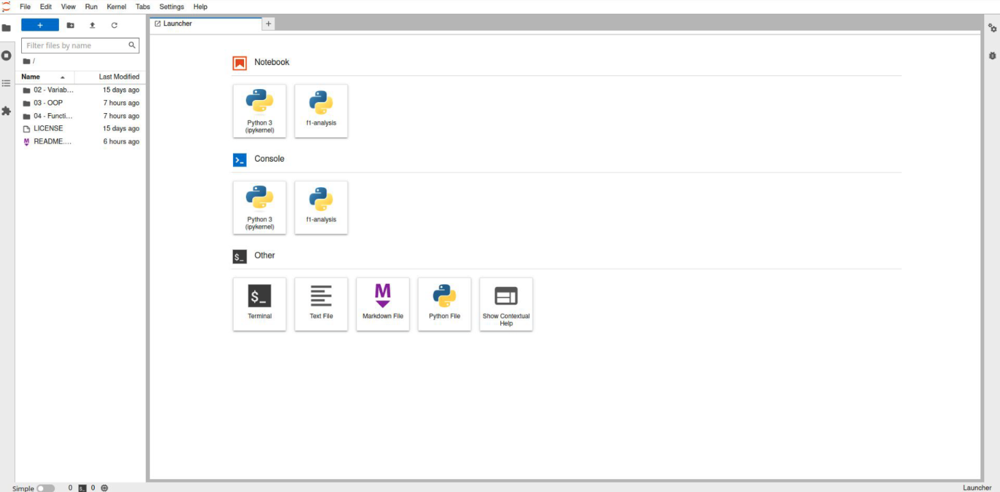
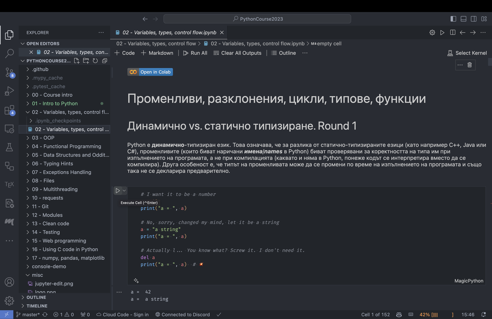

# Как да си пускаме лекциите и материалите от курса?

Всички лекции са под формата на Jupyter notebooks. Това са "тетрадки", чието съдържание е структурирано под формата на клетки, които биват два типа - такива с текст (в [Markdown формат](https://www.markdownguide.org/basic-syntax/)) и такива с код.

Клетките с код са изпълними и техният резултат от изпълнението е изписан непосредствено под тях.

В случай, че просто искате да четете лекциите, без да редактирате/изпълнявате съдържанието, можете да ги отваряте в [сайта на курса](https://fmipython.github.io/PythonCourse2023/README.html) (който е под формата на [Jupyterbook](https://jupyterbook.org/en/stable/intro.html)) или директно в GitHub да ги разглеждате.

Ако желаете да си експериментирате с примерите, които се дават в лекциите, и да им подкарвате кода, то има няколко начина за това:

## Вариант 1: Онлайн, чрез Google Collab бутона в Jupyterbook-a

1. Отворете съответната лекция в [сайта на курса](https://fmipython.github.io/PythonCourse2023/README.html)
2. Най-горе има една иконка на ракетка, като при натискането ѝ има опцията да се отвори лекцията в Google Collab:



Това ще създаде копие на notebook-a във вашия акаунт в Google Collab, с цел да можете колкото си искате да експериментирате. Кодът се изпълнява в клауд (на машини на Google).

🚀 За желаещите да се заниимават професионално с Data Science / AI / ML е препоръчително да си поиграят там, понеже Google Collab се използва изключително широко в тази практика и е хубаво човек да свикне със средата на разработка, която платформата предоставя.

## Вариант 2: Локално, чрез JupyterLab

1. Изтеглете от гитхъб репото на курса
    ```bash
    git clone https://github.com/fmipython/PythonCourse2023.git
    ```

2. Навигирайте до папката на курса
    ```bash
    cd PythonCourse2023
    ```

3. Изтеглете Jupyter и JupyterLab
    ```bash
    pip install jupyter jupyterlab
    ```
(възможно е да трябва да напишете `pip3` вместо `pip`)

4. Изпълнете командата: 
    ```bash
    jupyter lab
    ```



## Вариант 3: Директно във Visual Studio Code

* **Вариант А - локално:** Ако ще работите локално на вашия компютър, изтеглете от гитхъб репото на курса:
    ```bash
    git clone https://github.com/fmipython/PythonCourse2023.git
    ```
    След което отворете във VSCode папката на курса. Това може да стане или чрез графичния интерфейс, или (ако сте добавили VSCode във PATH) чрез командата `code PythonCourse2023`.

* **Вариант Б - онлайн:** В [Github страницата на курса](https://github.com/fmipython/PythonCourse2023) (и по принцип във всяко Github repository) можете да натиснете `.` (точка) на клавиатурата, за да отворите Web VSCode. 🪄 Това ще ви позволи да редактирате свои копия на файловете директно онлайн в браузъра, без да се налага да ги изтегляте и качвате ръчно.

1. Свалете Jupyter

    Отворете терминал (ако сте във VSCode в браузъра, може с View > Terminal) и напишете:
    ```bash
    pip3 install jupyter ipykernel
    ```
    (възможно е да трябва да напишете `pip` вместо `pip3`)

2. Свалете [Jupyter extension-а за VSCode](https://marketplace.visualstudio.com/items?itemName=ms-toolsai.jupyter) (ако го нямате вече)

3. Отворете някоя лекция във VSCode.

Би трябвало да изглежда по подобен начин:



От бутонът горе вдясно "Select Kernel" избирате конкретният Python интерпретатор, с който да се изпълняват клетките.

Чрез Run бутоните (или Ctrl+Enter) можете да изпълнявате клетките.
