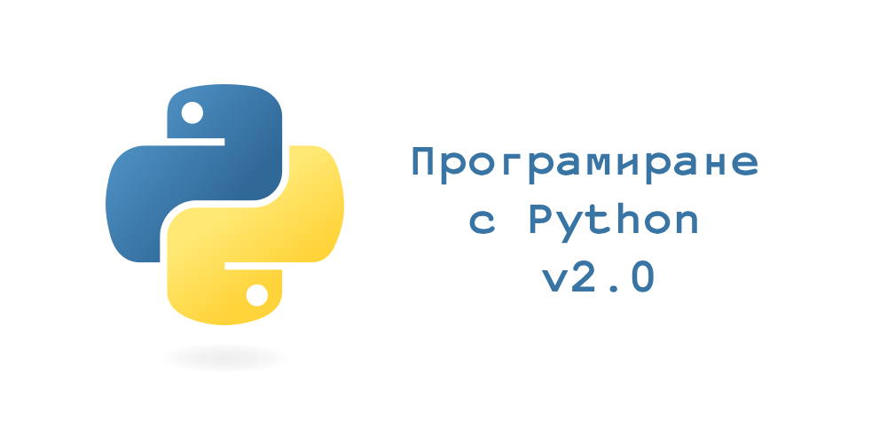

# Курс "Програмиране с Python" 2023

Github repository към курса "Програмиране с Python" във ФМИ

email: pythoncoursefmi@gmail.com

## Провеждане
понеделник и четвъртък 18:00-20:00, зали 200 и 604(ФХФ) съответно.

### Лекции

Всички лекции са събрани под формата на Jupyter notebook интерактивни записки. 

JupyterBook "книжка" с всички теми има тук: https://fmipython.github.io/PythonCourse2023

| Тема номер | Тема                                                      | Дата       | Лектор     |
| ---------- | --------------------------------------------------------- | ---------- | ---------- |
| 0 | [Въведение към курса](./00%20-%20Course%20intro/) | 05.10.2023 | [Любо](https://github.com/lyubolp)/[Алекс](https://github.com/yalishanda42)/[Кари](https://github.com/karinaghristova) |
| 1          | [Въведение в Python: какво е Python, настройка на средата, как да пуснем лекциите](./01%20-%20Intro%20to%20Python/) | 05.10.2023 | [Любо](https://github.com/lyubolp)/[Алекс](https://github.com/yalishanda42)/[Кари](https://github.com/karinaghristova) |
| 2          | [Променливи, разклонения, цикли](./02%20-%20Variables,%20types,%20control%20flow/) | 09.10.2023, 12.10.2023 | [Алекс](https://github.com/yalishanda42) |
| 3          | [Обектно-ориентирано програмиране в Python](./03%20-%20OOP/)                           | 16.10.2023, 19.10.2023 | [Алекс](https://github.com/yalishanda42) |
| 4          | [Функционално програмиране в Python](./04%20-%20Functional%20Programming/)             | 26.10.2023, 30.10.2023 | [Любо](https://github.com/lyubolp)  |
| 5          | [Представяне на структури от данни и алгоритми над тях](./05%20-%20Data%20Structures%20and%20Oddities/)     | 06.11.2023, 09.11.2023 | TBD       |
| 6          | [Типова система на езика](./06%20-%20Typing%20Hints/)                                   | 16.11.2023 | [Алекс](https://github.com/yalishanda42)      |
| 7          | [Грешки и изключения](./07%20-%20Exceptions%20Handling/) | 20.11.2023 | [Алекс](https://github.com/yalishanda42)      |
| 8          | [Работа с файлове](./08%20-%20Files/) | 23.11.2023 | [Любо](https://github.com/lyubolp)       |
| 9          | [Многонишково програмиране](./09%20-%20Multithreading/) | 30.11.2023 | [Любо](https://github.com/lyubolp)       |
| 10         | [Работа със заявки](./10%20-%20requests/) | 04.12.2023 | [Алекс](https://github.com/yalishanda42)      |
| 11         | [Работа с Git](./11%20-%20Git/)                                              | 04.12.2023 | [Алекс](https://github.com/yalishanda42)      |
| 12         | [Модули и пакети](./12%20-%20Modules/)                                           | 07.12.2023, 11.12.2023 | [Алекс](https://github.com/yalishanda42)      |
| 13         | [Принципи на качествения код на Python](./13%20-%20Clean%20code/)                     | 18.12.2023 | [Любо](https://github.com/lyubolp)       |
| 14         | [Тестване в Python](./14%20-%20Testing/)                                         | 21.12.2023 | [Алекс](https://github.com/yalishanda42)      |
| 15         | [Уеб програмиране. Flask](./15%20-%20Web%20programming/)                                   | 08.01.2024 | [Любо](https://github.com/lyubolp)       |
| 16         | [Използване на C код в Python](./16%20-%20Using%20C%20code%20in%20Python/)                              | 11.01.2024 | [Любо](https://github.com/lyubolp)       |
| 17         | [Външни библиотеки (numpy, pandas, matplotlib)](./17%20-%20numpy,%20pandas,%20matplotlib/)             | 15.01.2024 | [Любо](https://github.com/lyubolp)       |

###  Упражнения

Тази година вместо домашни ще имаме упражнения, на които ще даваме точки за решени задачи. Ще ги провеждаме в следните dedicated дати за упражнения:

| № | Дата       | Теми           | Линк |
|---|------------|----------------|------|
|1  | 23.10.2023 | 2, 3           | [Задачи](https://github.com/fmipython/PythonCourse2023/blob/master/labs/lab01.ipynb)|
|2  | 2.11.2023  | 4              | [Задачи](https://github.com/fmipython/PythonCourse2023/blob/master/labs/lab02.ipynb)|
|3  | 13.11.2023 | 5              | |
|4  | 27.11.2023 | 6, 7, 8        | |
|5  | 14.12.2023 | 9, 10, 11, 12  | |
|6  | 4.1.2024   | 13, 14         | |
|7  | 18.1.2024  | 15, 16, 17     | |

Освен на тези дати, възможно е да се решават задачи и ако остане време след някои лекции.

## Оценяване

Крайната оценка (мин 2, макс 6) се изчислява по следната формула:

$$ Оценка = \frac{Упражнения + Презентация + Бонус + Проект}{10} $$

Нужно е да отбележим, че **нито един от четирите компонента не е задължителен** за успешното взимане на курса.

Максимални точки:

* Упражнения: 30т.
* Презентация: 5т.
* Бонус: 5т.
* Проект: 40т.

# Как да пиша и подкарам Python кода си?

Вж. [тук](./01%20-%20Intro%20to%20Python/install-n-setup.md)

# Как да си пуснем лекциите/материалите?

Вж. [тук](./01%20-%20Intro%20to%20Python/notebooks.md)

# Принос

Ако откриете бъг, правописна грешка или генерално нещо грешно, може да отворите pull request чрез съответен branch съдържащ номера на лекцията. При промяна на някоя от тетрадките, задължително изпълнете тетрадката отначало преди качването в Git (за да са подредени номерцата на output-ите).
